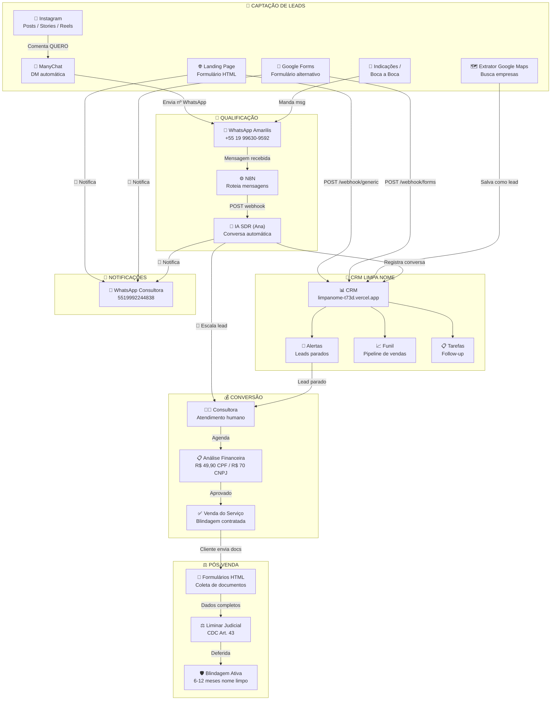

# 🔄 Fluxo Completo — Amarilis Soluções

## Diagrama Geral



---

## 📌 Todos os Caminhos do Usuário

### CAMINHO 1 — Instagram → ManyChat → WhatsApp

```
📱 Lead vê Post/Story/Reel no Instagram
    ↓ Comenta "QUERO" ou palavra-chave
🤖 ManyChat envia DM automática
    ↓ Qualifica: PF/PJ, situação, valor da dívida
    ↓ Segmenta: Negativado / Não sabe / Empresário / Quer entender
📱 ManyChat envia nº do WhatsApp da Amarilis
    ↓ Lead manda mensagem
🤖 IA Ana (SDR) responde automaticamente
    ↓ Conversa registrada no CRM
    ↓ Se lead quer agendar → [ESCALAR]
        → Cria tarefa urgente 🚨 no CRM
        → 📲 Notifica consultora via WhatsApp
        → Desativa IA pro lead
        → Consultora assume a conversa
```

**Notificação que chega no celular:**
```
🚨 *LEAD QUALIFICADO!*

👤 *Nome:* João Silva
📱 *Telefone:* 19999999999
💬 *Última msg:* "Quero agendar uma consulta"
🤖 *Ana respondeu:* "Ótimo! Vou transferir para uma consulto..."

⚡ Abra o CRM para ver a conversa completa e entre em contato!
```

**Onde está no código:** [`ia-sdr.js`](file:///c:/Users/Alan%20Moreira/Documents/00%20-%202026/05%20-%20LIMPA%20NOME/routes/ia-sdr.js#L122-L153)

---

### CAMINHO 2 — Landing Page (HTML) → CRM → WhatsApp

```
🌐 Lead acessa a landing page
    ↓ Preenche: Nome, WhatsApp, CPF, Email, Serviço
    ↓ Clica "Quero Blindar Meu Nome"
📡 JS envia POST para /api/webhook/generic
    ↓ CRM cria lead no Supabase
    ↓ CRM cria tarefa de follow-up
    ↓ 📲 Notifica consultora via WhatsApp
🌐 Página mostra "Cadastro realizado!" + botão WhatsApp
    ↓ Lead clica "Continuar no WhatsApp"
📱 Abre WhatsApp com mensagem pré-pronta
    ↓ IA Ana assume a conversa (mesmo fluxo do caminho 1)
```

**Notificação que chega no celular:**
```
📋 *NOVO LEAD - LANDING PAGE!*

👤 *Nome:* Maria Souza
📱 *Telefone:* 15991234567
📧 *Email:* maria@email.com
🎯 *Interesse:* Limpa Nome (Serasa, SPC, Boa Vista)
📌 *Origem:* landing_page

⚡ Abra o CRM para entrar em contato!
```

**Onde está no código:** [`webhook.js`](file:///c:/Users/Alan%20Moreira/Documents/00%20-%202026/05%20-%20LIMPA%20NOME/routes/webhook.js#L251-L287) (rota `/generic`)

**Landing page:** [`AUTOMAÇÃO/index.html`](file:///c:/Users/Alan%20Moreira/Documents/00%20-%202026/05%20-%20LIMPA%20NOME/AUTOMAÇÃO/index.html)

---

### CAMINHO 3 — Google Forms → Google Apps Script → CRM → WhatsApp

```
📝 Lead preenche Google Forms
    ↓ Google Apps Script captura o envio
    ↓ Script envia POST para /api/webhook/forms
📡 CRM recebe e cria lead no Supabase
    ↓ Registra no histórico
    ↓ Cria tarefa de follow-up (24h)
    ↓ 📲 Notifica consultora via WhatsApp
```

**Notificação que chega no celular:**
```
📋 *NOVO LEAD - GOOGLE FORMS!*

👤 *Nome:* Pedro Lima
📱 *Telefone:* 11988887777
📧 *Email:* pedro@gmail.com
🎯 *Serviço:* Pacote Completo

⚡ Abra o CRM para entrar em contato!
```

**Onde está no código:** [`webhook.js`](file:///c:/Users/Alan%20Moreira/Documents/00%20-%202026/05%20-%20LIMPA%20NOME/routes/webhook.js#L78-L130) (rota `/forms`)

**Google Apps Script:** [`google-apps-script.js`](file:///c:/Users/Alan%20Moreira/Documents/00%20-%202026/05%20-%20LIMPA%20NOME/google-apps-script.js)

---

### CAMINHO 4 — WhatsApp Direto (Indicação / Boca a Boca)

```
📱 Lead manda mensagem direto no WhatsApp da Amarilis
    ↓ Meta API recebe e envia pra N8N (VPS)
    ↓ N8N extrai dados e envia POST para /api/ia-sdr/webhook
🤖 IA Ana responde automaticamente
    ↓ Se lead novo: cria no Supabase como "lead"
    ↓ Se lead existe: registra msg no histórico
    ↓ Se [ESCALAR]:
        → Cria tarefa urgente 🚨
        → 📲 Notifica consultora via WhatsApp
        → Desativa IA • Consultora assume
```

**Onde está no código:** [`ia-sdr.js`](file:///c:/Users/Alan%20Moreira/Documents/00%20-%202026/05%20-%20LIMPA%20NOME/routes/ia-sdr.js#L11-L200) (rota `/webhook`)

**Workflow N8N:** [`n8n_ia_sdr_workflow.json`](file:///c:/Users/Alan%20Moreira/Documents/00%20-%202026/05%20-%20LIMPA%20NOME/AUTOMAÇÃO/n8n_ia_sdr_workflow.json)

---

### CAMINHO 5 — Extrator Google Maps → CRM

```
🗺️ Consultora busca no CRM: "contabilidade Campinas"
    ↓ Google Places API retorna empresas
    ↓ Seleciona contatos relevantes
    ↓ CRM salva como leads (origem: google_maps)
    ↓ Cria tarefa de contato (2 dias)
    ↓ ⚠️ SEM notificação WhatsApp (consultora já está no CRM)
```

**Onde está no código:** [`prospeccao.js`](file:///c:/Users/Alan%20Moreira/Documents/00%20-%202026/05%20-%20LIMPA%20NOME/routes/prospeccao.js#L142-L283)

---

## 📩 Follow-Up Automático (N8N)

Após o lead se cadastrar, o N8N envia mensagens automáticas em 3 momentos:

| Dia | Tipo | Mensagem |
|-----|------|----------|
| **Dia 1** | Acolhimento | "Você se cadastrou ontem... nossa equipe já está analisando!" |
| **Dia 3** | Reengajamento | "Já faz 3 dias... quer dar continuidade à blindagem?" |
| **Dia 7** | Urgência + Opt-out | "Responda SIM para saber mais ou NÃO se não tiver interesse" |

**Workflow N8N:** [`n8n_workflow_followup.json`](file:///c:/Users/Alan%20Moreira/Documents/00%20-%202026/05%20-%20LIMPA%20NOME/AUTOMAÇÃO/n8n_workflow_followup.json)

---

## 🌐 HTML — Landing Page (enviada ao lead)

A landing page é o arquivo [`AUTOMAÇÃO/index.html`](file:///c:/Users/Alan%20Moreira/Documents/00%20-%202026/05%20-%20LIMPA%20NOME/AUTOMAÇÃO/index.html), hospedada separadamente.

### Estrutura da Página:

| Seção | Conteúdo |
|-------|----------|
| **Navbar** | Logo Amarilis + links (Home, Como Funciona, Serviços, FAQ) + CTA "Fazer Consulta" |
| **Hero** | Título "Blindagem do seu nome" + formulário de captura |
| **Formulário** | Nome*, WhatsApp*, CPF, Email, Serviço (dropdown) → botão "Quero Blindar Meu Nome" |
| **Prova Social** | 500+ nomes blindados • 12 meses proteção • 98% liminares deferidas • 5 birôs |
| **Como Funciona** | 3 passos: Consulta → Ação Judicial → Nome Blindado |
| **Serviços** | Limpa Nome • Protestos • BACEN • Score • Rating • CDC |
| **Antes/Depois** | Comparação: SEM blindagem vs COM blindagem |
| **Depoimentos** | 3 depoimentos (Marina S., Roberto C., Ana Paula L.) |
| **FAQ** | 7 perguntas frequentes com respostas |
| **CTA Final** | "Você tem direito de ter seu nome limpo" + botão |
| **Footer** | Links + contato + copyright |
| **WhatsApp Float** | Botão flutuante verde no canto da tela |

### O que acontece quando o formulário é enviado:

```
1. JS coleta: nome, telefone, cpf, email, servico
2. POST → https://limpanome-t73d.vercel.app/api/webhook/generic
3. Se N8N configurado → dispara webhook de boas-vindas
4. Monta link wa.me com mensagem pré-pronta
5. Mostra tela de sucesso: "Cadastro realizado!" + botão "Continuar no WhatsApp"
```

**JavaScript:** [`AUTOMAÇÃO/script.js`](file:///c:/Users/Alan%20Moreira/Documents/00%20-%202026/05%20-%20LIMPA%20NOME/AUTOMAÇÃO/script.js)

**CSS:** [`AUTOMAÇÃO/style.css`](file:///c:/Users/Alan%20Moreira/Documents/00%20-%202026/05%20-%20LIMPA%20NOME/AUTOMAÇÃO/style.css)

---

## 🔔 Resumo das Notificações WhatsApp

| Origem do Lead | Notifica via WhatsApp? | Mensagem | Arquivo |
|---------------|:---------------------:|----------|---------|
| **Instagram → ManyChat** | ❌ Não automático | Lead chega pelo ManyChat → CRM via webhook | — |
| **WhatsApp → IA SDR** | ✅ Ao escalar | `🚨 LEAD QUALIFICADO!` | `ia-sdr.js` |
| **Landing Page** | ✅ Sempre | `📋 NOVO LEAD - LANDING PAGE!` | `webhook.js` |
| **Google Forms** | ✅ Sempre | `📋 NOVO LEAD - GOOGLE FORMS!` | `webhook.js` |
| **Extrator Maps** | ❌ Não | Consultora já está no CRM | — |

**Número de destino:** variável `NOTIF_WHATSAPP_NUMERO` (fallback: `5519992244838`)

---

## 🛠️ Ferramentas do Ecossistema

| Ferramenta | Função | URL/Local |
|------------|--------|-----------|
| **CRM** | Gestão de leads/clientes | limpanome-t73d.vercel.app |
| **IA SDR (Ana)** | Atendimento WhatsApp | Integrada no CRM (GPT-4o-mini) |
| **N8N** | Roteamento de mensagens | n8n.srv1121163.hstgr.cloud |
| **ManyChat** | Captação Instagram | manychat.com |
| **Meta API** | WhatsApp Business | graph.facebook.com/v19.0 |
| **Supabase** | Banco de dados | nhmkcmldwhlzvkknvrrn.supabase.co |
| **Google Maps** | Extração de leads | API Places |
| **OpenAI** | IA das respostas | GPT-4o-mini |
| **Vercel** | Hospedagem CRM | vercel.com |
| **Landing Page** | Captura de leads | AUTOMAÇÃO/index.html |
| **Google Forms** | Formulário alternativo | Apps Script → CRM |
