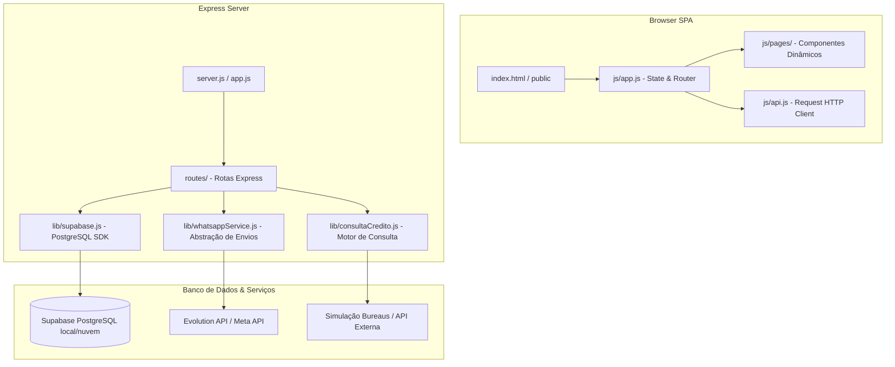

# Documentação Técnica - CRM Limpa Nome

Este documento contém todas as informações necessárias para que qualquer desenvolvedor ou inteligência artificial possa entender, dar manutenção, testar e evoluir o projeto **CRM Limpa Nome**.

---

## 📌 1. Visão Geral do Sistema

O **CRM Limpa Nome** é uma plataforma de gestão de relacionamento com o cliente (CRM) especializada no setor de assessoria de reabilitação de crédito (limpa nome, blindagem de score, processos liminares de exclusão de apontamentos nos bureaus e no Banco Central/BACEN).

O sistema permite:
* Acompanhar a esteira de vendas/pipeline dos leads (desde a prospecção até o contrato fechado).
* Consultar e simular restrições financeiras e score de CPFs/CNPJs de forma automatizada.
* Cadastrar e monitorar dívidas, processos judiciais liminares e apontamentos no SCR (BACEN).
* Realizar disparos automatizados e atendimento inteligente via WhatsApp (integrado nativamente com a **Evolution API** ou **Meta Cloud API**).
* Armazenar documentos e PDFs de forma organizada associados a cada cliente.

---

## ⚙️ 2. Arquitetura de Software

O projeto segue um modelo **Monolito Híbrido** com separação clara entre Backend e Frontend:



### 🖥️ Frontend
* **Tecnologias**: HTML5 Vanilla, Javascript Moderno (ES6+) e CSS3 nativo.
* **Paradigma**: Single Page Application (SPA) reativa construída manualmente sem frameworks pesados.
* **Componentização**: Localizada em `public/js/pages/` (arquivos `.js` que geram HTML dinâmico com templates literais e gerenciam seu próprio estado local).
* **Roteamento**: Controlado no frontend pelo `public/js/app.js` escutando alterações de hash na URL (ex: `#/clientes`, `#/clientes/detalhe?id=X`).

### 🖧 Backend
* **Tecnologias**: Node.js (v18+), Express.
* **Autenticação**: Baseada em token JWT autogerenciado no backend (`lib/authMiddleware.js`), com senha mestra definida nas variáveis de ambiente.

---

## 🗄️ 3. Banco de Dados (PostgreSQL)

O CRM utiliza o **PostgreSQL** (hospedado localmente no Docker da VPS ou no Supabase Cloud). O banco de dados não exige habilitar RLS (Row Level Security) uma vez que a autenticação e segurança de rotas são validadas na camada do Express.

### Principais Tabelas:

1. **`clientes`**: Cadastro principal (nome, documento, telefone, status no funil, score inicial e score atual).
2. **`dividas`**: Restrições financeiras (credor, valor original, valor atualizado, vencimento, bureau como Serasa/SPC/Boa Vista e status).
3. **`processos`**: Processos jurídicos/liminares ajuizados para a remoção das restrições.
4. **`apontamentos_bacen`**: Registros de prejuízo ou vencidos listados no SCR do Banco Central.
5. **`score_historico`**: Histórico temporal de scores do cliente para geração de relatórios e evolução.
6. **`historico`**: Timeline de ações/eventos do cliente para auditoria (registro automático de alterações, consultas de crédito, disparos de mensagens).
7. **`tarefas`**: Kanban e follow-ups associados aos clientes.
8. **`documentos`**: Caminhos e URLs dos PDFs armazenados no bucket do Supabase Storage.
9. **`tabela_precos`**: Tabela com preços dos serviços cobrados para cada produto do portfólio.

### Views e Functions Úteis:
* **`clientes_view`**: Agrega dados de dívidas e processos de cada cliente para exibição rápida em listas e pipeline.
* **`get_dashboard_stats()`**: Função RPC no Postgres que compila todas as métricas do painel do dashboard em uma única chamada de alta performance.

---

## 🔌 4. Integrações Principais

### 💬 WhatsApp (Evolution API & Meta Cloud API)
Centralizado no módulo `lib/whatsappService.js`.
* **Fluxo**: Ao realizar um envio, o serviço checa se as variáveis `EVOLUTION_API_URL` e `EVOLUTION_API_KEY` estão configuradas no `.env`.
  * **Se configuradas**: Envia via Evolution API (WhatsApp real).
  * **Se vazias**: Utiliza o fallback automático pela Meta Cloud API (API Oficial Cloud).
* **Consumo**: Utilizado para disparos manuais, campanhas e automações do SDR Inteligente (`lib/sdrAgent.js`).

### 💳 Consulta Automática de Crédito
Centralizado no módulo `lib/consultaCredito.js`.
* **Fluxo**: O endpoint `POST /api/clientes/:id/consultar-credito` invoca o motor que valida o CPF/CNPJ, realiza a consulta determinística de crédito e:
  1. Atualiza o score atual do cliente.
  2. Grava um registro no histórico de scores (`score_historico`).
  3. Limpa restrições importadas anteriormente para evitar duplicidade.
  4. Insere no banco as restrições de dívidas ativas nos bureaus (Serasa, SPC, Boa Vista).
  5. Insere os apontamentos do Banco Central (SCR).
  6. Registra toda a atividade na timeline do cliente.

---

## 📂 5. Estrutura de Pastas

```
05 - LIMPA NOME/
├── .vercel/                 # Metadados de vínculo com a Vercel
├── api/                     # Serverless endpoints para Vercel
│   └── index.js             # Ponto de entrada Vercel Serverless
├── lib/                     # Módulos core e serviços do backend
│   ├── authMiddleware.js    # Proteção de rotas com JWT
│   ├── consultaCredito.js   # Serviço de consulta de bureaus
│   ├── sdrAgent.js          # Agente IA para SDR WhatsApp
│   ├── supabase.js          # Conexão com SDK Supabase
│   └── whatsappService.js   # Unified WhatsApp Sender
├── public/                  # Arquivos públicos estáticos (Frontend)
│   ├── css/                 # Estilos Vanilla CSS
│   ├── js/                  # Scripts
│   │   ├── pages/           # SPAs de cada tela (dashboard, clientes, etc)
│   │   ├── api.js           # Client HTTP (API wrapper)
│   │   └── app.js           # Estado global, inicialização e rotas
│   └── index.html           # HTML Único da SPA
├── routes/                  # Rotas Express organizadas por domínio
│   ├── clientes.js          # CRUD de clientes e endpoint de crédito
│   ├── whatsapp.js          # Disparos de mensagens
│   ├── ia-sdr.js            # Webhook da IA SDR
│   └── ...
├── app.js                   # Setup do Express e middlewares
├── server.js                # Inicialização do servidor local na porta 3000
├── supabase-schema.sql      # Estrutura do banco de dados (Tabelas e RPC)
├── vercel.json              # Configurações de rotas e build Vercel
└── .env                     # Configurações sensíveis (não commitado)
```

---

## 🔑 6. Configuração do Arquivo `.env`

Crie um arquivo `.env` na raiz do projeto contendo:

```env
# Senha de login do painel administrativo
CRM_PASSWORD="sua_senha_segura"
JWT_SECRET="chave_secreta_jwt_criptografia"

# Supabase (Banco de dados e API)
# Se rodar local na VPS: URL="http://localhost:8000"
SUPABASE_URL="https://seu-projeto.supabase.co"
SUPABASE_ANON_KEY="sua_chave_publica_anon"

# Configuração WhatsApp - Evolution API (Primário)
EVOLUTION_API_URL="https://sua-api.evolution.com"
EVOLUTION_API_KEY="seu_token_apikey_evolution"
EVOLUTION_INSTANCE_NAME="nome_da_instancia"

# Configuração WhatsApp - Meta Cloud API (Fallback)
META_PHONE_NUMBER_ID=""
META_WHATSAPP_TOKEN=""

# OpenAI (Usado pelo SDR Inteligente)
OPENAI_API_KEY="sk-proj-..."
```

---

## 🚀 7. Como Rodar e Fazer Deploy

### Desenvolvimento Local:
1. Instale as dependências: `npm install`
2. Configure o arquivo `.env.local`
3. Execute o servidor: `npm run dev` (roda em `http://localhost:3000`)

### Hospedagem na VPS (Ubuntu + Docker + PM2):
O projeto está configurado para rodar com o banco de dados Supabase hospedado na própria VPS via Docker Compose para total controle.

1. **Subir o Banco de Dados (Supabase)**:
   ```bash
   cd /var/www/supabase/docker
   docker compose up -d
   ```
   *(Nota: O banco de dados estará rodando internamente no Docker e exposto na porta `5435`).*

2. **Criar Estrutura de Tabelas**:
   Execute os scripts SQL locais da pasta do CRM para dentro do container do banco:
   ```bash
   docker exec -i supabase-db psql -U postgres -d postgres < /var/www/limpanome/supabase-schema.sql
   docker exec -i supabase-db psql -U postgres -d postgres < /var/www/limpanome/supabase-schema-rating.sql
   docker exec -i supabase-db psql -U postgres -d postgres < /var/www/limpanome/supabase-schema-servicos.sql
   ```

3. **Iniciar o CRM**:
   Acesse a pasta `/var/www/limpanome` e inicie o gerenciador de processos:
   ```bash
   pm2 start server.js --name "crm-limpanome"
   pm2 startup
   pm2 save
   ```
   O CRM rodará na porta `3000` de forma contínua.

---

## ⚙️ 8. Configuração e Recuperação da Evolution API (VPS)

Caso precise reconfigurar, reinstalar ou recuperar a Evolution API na VPS Hostinger, siga as instruções abaixo. A configuração atual está ativa usando contêineres Docker e integrada ao CRM.

### 📋 Portas e Credenciais Ativas (Maio/2026):
* **Evolution API (Host):** `http://localhost:8084` (Exposto externamente em `http://217.196.61.190:8084`)
* **Evolution Postgres (Host):** `5436` (Senha: `pg_evo_pass_2026_987x`)
* **Global API Key:** `evo_api_key_2026_secure_key_192`
* **Nome da Instância:** `limpa_nome_instance`
* **Redis:** Desativado (`REDIS_ENABLED=false` e `CACHE_REDIS_ENABLED=false`) para evitar loops de erro que impedem conexões do WhatsApp.

### 1. Subindo os Containers (Docker Compose)
O arquivo `docker-compose.yml` está na raiz do projeto. Para subir ou reiniciar o serviço na VPS:
```bash
docker compose down
docker compose up -d
```

### 2. Criação da Instância e Conexão do QR Code
A instância `limpa_nome_instance` já foi criada. Para exibir o QR Code em tempo real e realizar o pareamento de forma segura (com auto-refresh a cada 15 segundos para evitar expiração do código), acesse em seu navegador:
👉 **`http://217.196.61.190:3000/api/ia-sdr/connect-view`**

*(Se precisar recriar a instância do zero via terminal, o endpoint é `POST /instance/create` com o conector `"integration": "WHATSAPP-BAILEYS"`)*.

### 3. Integração com o CRM
No arquivo `.env` do CRM na VPS, as variáveis configuradas são:
```env
EVOLUTION_API_URL="http://localhost:8084"
EVOLUTION_API_KEY="evo_api_key_2026_secure_key_192"
EVOLUTION_INSTANCE_NAME="limpa_nome_instance"
```
Após qualquer alteração, reinicie o CRM no PM2:
```bash
pm2 restart crm-limpanome
```

### 4. Próximo Passo: Configuração do Webhook (Ativação da IA Ana)
Assim que você **escanear o QR Code** e conectar o WhatsApp através da página `/connect-view`, a Evolution API precisa ser instruída a notificar o CRM sobre novas mensagens recebidas.

Para ativar o webhook da IA, execute o seguinte comando `curl` no terminal da VPS:
```bash
curl -X POST "http://localhost:8084/webhook/set/limpa_nome_instance" \
     -H "Content-Type: application/json" \
     -H "apikey: evo_api_key_2026_secure_key_192" \
     -d '{
       "enabled": true,
       "url": "http://217.196.61.190:3000/api/ia-sdr/webhook",
       "byEvents": true,
       "events": [
         "MESSAGES_UPSERT"
       ]
     }'
```
Isso ligará o fluxo de recebimento do webhook na rota pública `/api/ia-sdr/webhook` para o processamento de conversas da IA.
